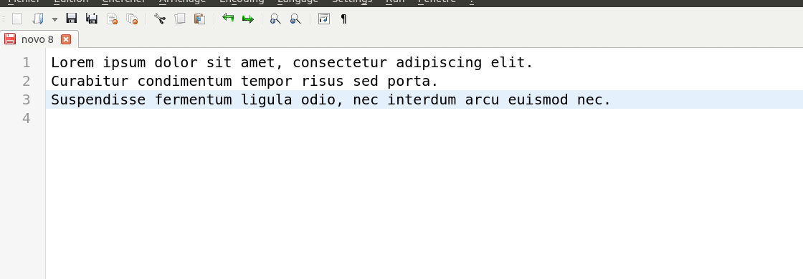

<h1 align="center">WIP: screenshot-to-text</h1>


Electron App that takes a screenshot of a selected area and extracts the included text. The text is extracted using the [tesseract.js](https://github.com/naptha/tesseract.js#tesseractjs) OCR


#### Run

```bash
npm start
```

#### Example of use



